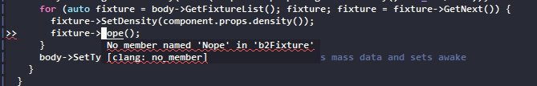
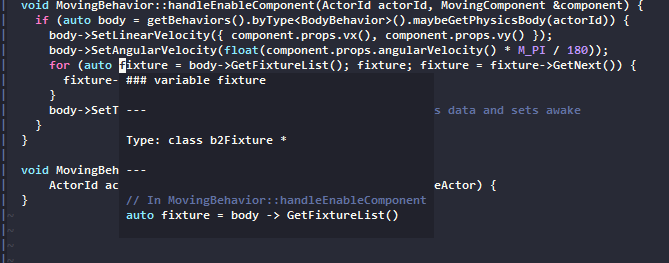
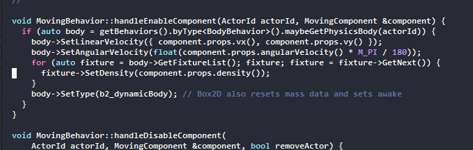

# Castle Core ⚙️

Welcome to the new Castle core! This project hopes to be a cross-platform
implementation of Castle's gameplay engine that can be used on web and mobile.
For now the project is starting with a focus on getting web working.

## Directory structure

- **src/**: The C++ core code
- **vendor/**: External libraries we depend on
- **web/**: A simple web harness with a canvas and a launcher for the core WASM
- **assets/**: Static assets for Emscripten to embed into the WASM binary
- **build/**: (ignored in Git) Build output from Emscripten, including the generated WASM binary
- **web-publish/**: Currently published test release of core for the web
- **tools/**: Useful tools for development, including code generation scripts

## Building and running

Make sure all submodules are initialized with `git submodule update --init --recursive`.

You'll need to install CMake and Ninja, which means `brew install cmake ninja`
on macOS, `sudo apt install cmake ninja-build`-ish on Linux or using their
official installers on Windows. `run.sh` needs WSL on Windows.

### Web

#### First-time setup

`./run.sh web-init` to setup Emscripten (our C++ web build toolchain). This
may take a little bit.

You will also need the '[castle-www](git@github.com:castle-xyz/castle-www.git)'
repository checked out at '../' relative to the checkout of this repository, to
actually serve the website and provide the surrounding scaffolding.

#### Build and run

`./run.sh web-release` to build a release version of core for the web. This
will again take a bit the very first time (Emscripten fetches and caches SDL2).
Later builds should (hopefully!) be faster. Every time you edit code in 'src/'
or 'web/' you'll have to run this again. It will copy the resulting '.wasm' and
other files to '../castle-www/...'.

Then, in '../castle-www', do `npm i` if you have't already and `npm run dev` to
serve the website.
[http://localhost:1337/p/ImdcvUwj2](http://localhost:1337/p/ImdcvUwj2) should
then show you a deck! You can change the URL parameter there to see other decks.

As a bonus, instead of invoking `./run.sh web-release` repeatedly you can use
`./run.sh web-watch-release` to start a file watcher that will launch a build
every time some source file changes. This needs
[entr](http://eradman.com/entrproject/), which you can install with `brew
install entr` or `sudo apt install entr` or such. Change and save some file,
make sure it's done building, and refresh your browser to see the updates!

Make sure to also keep the '../castle-www' directory up to date with git and
`npm i`.

### Mobile

- `./run.sh ios-release` - builds core for iOS, Release, device only. The binaries are copied to `binaries/ios` and picked up by the Xcode project at `../mobile/ios`.
- `./run.sh ios-simulator-debug` - builds core for iOS, with debug symbols, simulator only.

### Desktop

#### Build and run

Core can also be built and run on desktop, just for development purposes (eg.
to use profiling tools or attach a local debugger) and not as an actual
production target. Web is the main priority, so the desktop build may be broken
from time to time.

Use `./run.sh release` for a desktop release build, and `./run.sh debug` for a
debug one. The resulting 'castle-core' executables end up in 'build/release' or
'build/debug' and can be used with a profiler or debugger tool. They need to be
launched with 'core/' as the working directory.

To build and run from Xcode, use `./run.sh xcode` then open
'build/xcode/castle-core.xcodeproj' and select the castle-core target.

## Development

If you're contributing changes to the codebase, please take the time to read
this section.

### Tools

`./run.sh db` will generate a 'compile_commands.json' file in '../', which can
be used by VSCode, vim with coc.nvim or many other editors to understand the
C++ codebase. Here's a few images and an animation showing such features from
vim -- auto complete, error indicators, hover information (useful to get types
of `auto` variables) and jump to definition:

To set up jump to definition with emacs:

- Install `ctags`: `brew install ctags`
- Run `ctags -e -R` from `src` to create the file `src/TAGS`
- Visit `src/TAGS` the first time you want to jump to a definition.

`./run.sh format` will auto-format the code. Needs
[clang-format](https://clang.llvm.org/docs/ClangFormat.html), which you can
install with `brew install clang-format` or such.

`./run.sh cloc` will show per-file and total lines of code counts for files in
'src/'. It ignores some modules that are just wrappers (like `Lv`) and ignores
test and debug files. This needs
[cloc](https://github.com/AlDanial/cloc#install-via-package-manager).

`VALGRIND=on ./run.sh release` will run a desktop release build with
[Valgrind](https://valgrind.org) which helps detect leaks and other memory
issues. Valgrind only runs well on Linux (I think...).

`./run.sh load-card Z5CXTBdpf8` loads a card scene into assets/test-watch.json.
Uncomment `#define WATCH_SCENE_FILE` in main.cpp to watch this file for changes.

### Values

We want this codebase to provide a robust, performant engine for Castle that
can be developed for a long time without gathering too much baggage. It's
important to care about the architecture and take the time to lay it all out
well. Here are some core values that could guide us in the beginning of this
project:

- Let's start out with very little, and only _add things as needed_. We're
  getting a chance for a fresh start but aided by all the experience, existing
  scene data and existing Lua code we've already collected. We can use that to
  make evidence-based decisions about what's necessary.
- Focus on _simplicity_. Prefer a well-understandable solution to a problem, if
  it's not clear that added complexity will gain us much.
- Focus on _performance_. For our engine, performance is a feature. Users can
  very easily run a "Repeat N" loop to create tons of actors, and the more the
  engine can handle, the more media exploration they can do.
- Focus on _pragmatism_. Solve for cases we will actually run into in practice.

### C++

#### Features

C++ has a large surface area with tons of gotchas and varying styles, with old
C++ code looking quite different from modern C++. We use C++17 in this
codebase, which provides us the following quite useful features:

- **`auto`**: Use `auto` often as the type of variables to avoid repeating
  yourself and to support generic constructs.
- **Constructors, destructors**: C++ will automatically destruct objects at the
  end of a scope. It will also automatically call member constructors and
  destructors at the right time for a containing object. You shouldn't have to
  define or manually call `.init()` / `.deinit()` style methods that often, and
  an object should almost never need to 'exist in an uninitialized state' -- if
  it exists, it must be initialized (even if empty, like an initially empty
  `Scene`).
- **Move semantics**: This allows us to keep a lot of objects as just 'values'
  but still move them around without copying. This is how
  `Snapshot::toScene()` can just return a `Scene` that is stored in `Engine`
  for example.
- **Lambdas**: Perhaps one of the most useful new(-ish) C++ features. Used
  extensively in our codebase to form control structures (eg.
  `forEachComponent`). If taken as an `F&&` template parameter the compiler
  will almost always inline these. Avoid `std::function` for the most part --
  we don't really need dynamic callbacks in our code.
- **`enum class`**: Always use `enum class` instead of bare `enum` to define
  enumerations. This scopes the enum value identifiers under the enum type.

Other various tips:

- Use `std::string` for an owned string member (eg. usually as a class member),
  but use `const char *` or `std::string_view` for non-owning reference to some
  other string (eg. usually as a function parameter or return value -- can be
  dangerous if stored long term!).
- Basically never use `new`, `delete`, `malloc` or `free` directly. Almost
  always try to use just a normal sub-object or value on the stack. For dynamic
  allocation of multiple instances, use a container like `std::vector`. If you
  really need dynamic allocation for a single object, use something like
  `std::unique_ptr` which ties memory management to constructors and
  destructors.

#### Guidelines

- **File structure**
  - Code is generally divided into 'modules'. Each module usually has one main
    class, with a few adjacent data structures that that class manages or is
    related to.
  - Each module is composed of one header ('.h') file and optionally (but often)
    an implementation ('.cpp') file.
  - The header file should first show the interface, without any function
    definitions, and include inline definitions at the bottom (under the common
    `// Inlined implementations` comment). Non-inline function definitions go in
    the implementation file.
  - **Prefer splitting up** interface and definition this way even within headers
    -- there is a slight repetition involved but it enables gleaning the
    structure of a module much more easily.
  - Having more code in header files can increase compile times, but also those
    definitions can get inlined into other code (providing better
    optimization). So generally only small, frequently called functions should
    be defined in headers.
- **Prevent copies**: Except for actual 'value types' (such as a `Vector2` for
  example), prevent copies as much as possible. Check out the top of
  'archive.h' for how `Archive` has copies prevented but moves allowed.
  Accidental copies may be bad for performance, but may be worse on logic
  errors (eg. accidentally only updating a discarded copy of a `getComponent()`
  result, instead of the actual data).
- **Be somewhat `const`-correct**: A `const Scene &` will only allow reading of
  component data, and not modification. Passing such a reference to a snapshot
  or draw method will make sure the scene data isn't accidentally edited.
  Methods on a class that only read data should be marked as `const` (on the
  end) to let them be used on `const` instances.
- **Don't store pointers in long term data (generally)**
  - Most methods that return pointers do so to return optional data by
    reference. The data pointed-to may be overwritten with other data when the
    underlying data structure is re-organized, so such pointers are
    short-lived.
  - This is especially important for pointers to components. The component
    storage system will move components in memory as they are added and
    removed, so pointers will be invalidated.
  - "Resources" like `love::Image`s are notable exceptions. For these, prefer
    an `std::unique_ptr` at the site of ownership, and pass references
    everywhere else.
  - `b2Body` is another exception. Here we need to actually just store a raw
    pointer because the `b2World` manages the memory and we must go through
    `b2World::DestroyBody`. Box2D does not move body data in memory, so
    pointers stay valid till the body is destroyed.
- **Prefer passing references vs. pointers**
  - It's clearer that the parameter isn't optional (can't pass `nullptr`).
  - You can use `.` rather than `->` to access members.
  - The main exception is for optional return values or parameters. eg.
    `Scene::maybeGetActor` will return a `nullptr` if not present. The code
    calling these should always handle the `nullptr` case.
- **Prefer default member initializers**
  - As much as possible, initialize members by directly writing their default
    values when defining the member itself (as opposed to in the constructor of
    the surrounding class).

### Architecture

Coming soon: explain how the current modules relate to each other, explain how
the actor / behavior system is architected, and how to add new behaviors.

### Entity-component-system lifetime safety

Various notes related to safety / lifetimes in the ECS, will flesh this out
more soon...

- When iterating through entt components (using `forEachComponent` or directly
  using `.view<...>().each(...)` etc. on the `entt::registry`), make sure to
  keep in mind which operations are allowed. The full details can be found in
  the [entt documentation](https://github.com/skypjack/entt/wiki/Crash-Course:-entity-component-system#what-is-allowed-and-what-is-not),
  but generally speaking:
  - You can destroy the currently visited entity (`Scene::removeActor` destroys
    the entity), but you can't destroy other entities
  - You can remove components from the currently visited entity, but you can't
    remove components from other entities
  - You can add components, of types other than the types being iterated, to
    this or any other entity
- In rule elements (responses, expressions) that operate on `ctx.actorId`, make
  sure they handle the scenario where that actor has already been destroyed.
  This should usually happen automatically when using eg. `maybeGetComponent`
  and handle the `nullptr` result scenario (which should be done regardless).
